# QCRunTransfer Ion Torrent Plugin

## Overview
This plugin takes a sequencing run on an Ion Torrent Proton or PGM and pushes the following files another server for analysis:
* _(Barcode)rawlib.bam_ - contains the aligned reads generated by the sequencing run
* _Sample.json_ - contains information metadata about the run and settings for running the [QC Scripts]()
* _(Barcode)rawlib.amplicon.cov.xls_ - (where available)
* _TSVC_variants.vcf_ - (where available)
* _report.pdf_ - a pdf of the run report for safekeeping
* _ionstats_alignment.json_ - contains alignment metrics such as total # of aligned bases

## Installing the Plugin
1. SSH into your Proton's or PGM's server and run the following command:

		git clone "https://github.com/jlaw9/QCRunTransfer.git" /results/plugins/QCRunTransfer

1. Add the new plugin to your Proton or PGM's Torrent Suite (TS) Browser

	> Settings -> Plugins -> click "Enabled" for QCRunTransfer

	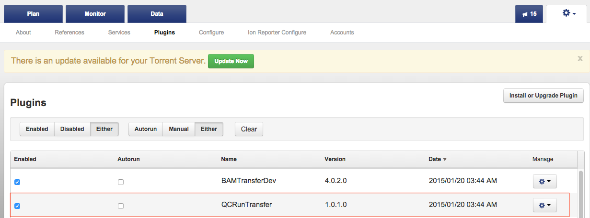

	QCRunTransfer should now be accessible as a plugin to run from a run report.

1. Create your project's JSON settings file. This sample JSON file will contain the settings for running the [QC_Scripts](). This file should go in the "scripts" directory of the plugin.

	TODO
	> Table

1. Add the new project option to the _instance.html_ file. 
Replace the value of "option value=XXXX" on line 133 with the name of your project. 
**value= needs to match the title of the JSON file created in step 3.** For example: a Cancer Exome project coule have a json named _Cancer.json_ and an option of ```html<option value="Cancer">Cancer Exomes</option>```.

	```html
	133 <tr><td align=right>Project: </td><td align=left><select name="project"><option value="TUMOR_NORMAL_PROJECT">Tumor Normal Project</option><option value="GERMLINE_PGM_PROJECT">Germline PGM Project</option></select></tr>
	```

	To add multiple projects, simply copy and paste the ```<option value="PROJECT">Project</option>``` section and repeat steps 3 and 4.

##Running the Plugin

Plugin Overview: The purpose of the QCRunTransfer plugin is automatically QC all the different runs of a sample, and then merge the passing runs. 
Because the proton and pgm servers must be dedicated to handling the sequencing, the actual QC scripts and analysis must be run on a separate analysis server. 
This plugin will push and organize a selected run’s bam file along with other JSON files to a specified location on an analysis server. 
A cron job on the analysis server will then find the runs of each sample pushed to analysis server, and will run QC_sample.py on each sample found (See Protocol “Automated Pipeline” for more information on this automated process). 
After the QC process is finished, QC_sample.py will then merge the “passing” (see protocol 1.3 “QC_Run” for cutoffs) runs of a sample, generate an excel spreadsheet for that sample, and finally will copy the QC spreadsheet back to the plugin directory of each run. 
Figure 1 gives an outline of the process.

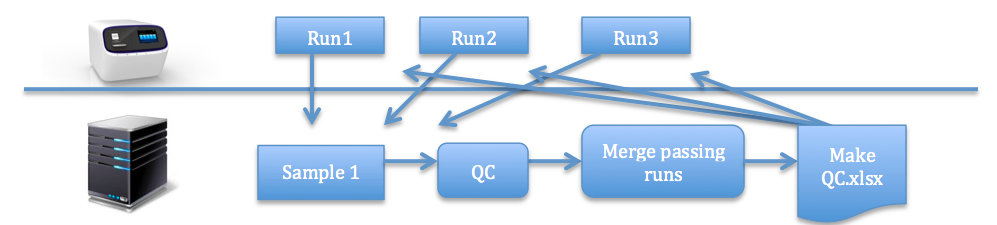

1. Connect to the proton or PGM from a web browser (safari,
chrome, etc.) by typing the server’s IP address into the browser and
login (See [Appendix I](#AppendixI) of Protocol 1.0 for login and
connection help).

1. Select a sequencing run found on the “Data” tab, then
“Completed Runs & Results” sub-tab.

	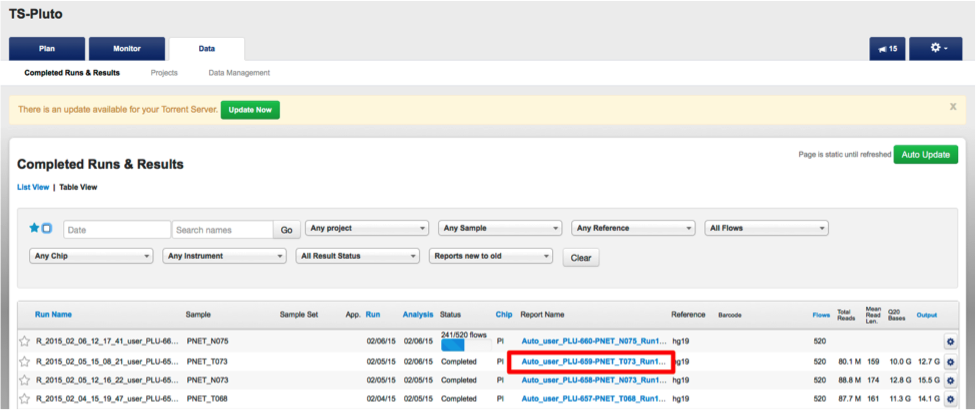

1. Scroll down to the bottom of the selected run and click
the button “Select plugins to run.” There you will see a list of plugins
available for this server. If the run is archived, unfortunately the
plugin cannot be used. I have another script to push archived runs, but
it must be run separately.

	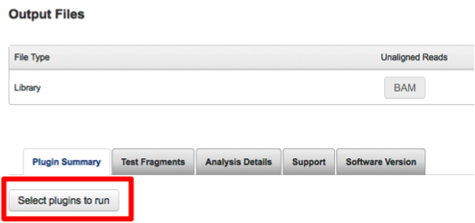

1. Select the plugin “QCRunTransfer.” If you do not see it,
then the plugin has not yet been loaded onto your current server. See
[Appendix I](#Appendix_I) for instructions on how to download the
plugin.

	

1. Run the plugin. 

	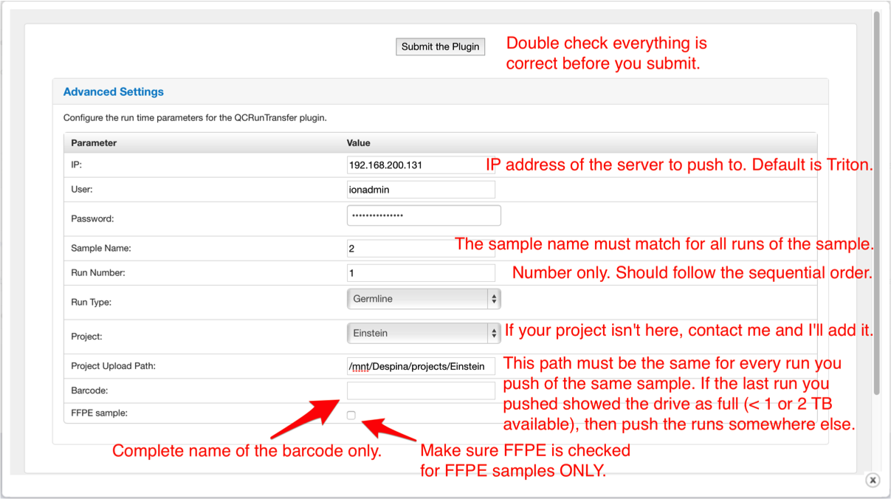

	TODO
	- If your project is not found, then the project JSON file has not yet
been made. I plan to add settings later on to set a project’s settings,
but for now, I (or your local bioinformatician) will have to handle
that.

	TODO
	- The server can send an email when the job is finished if ssmtp is setup.


1. Understand the plugin output. See 6i and 6ii for screenshots and descriptions of the output.

	1. In the red box you can see the amount of space left in the mount or partition you are trying to push. 
	In the top right of the plugin output box, you have options to access the plugin log, or delete the plugin result.

		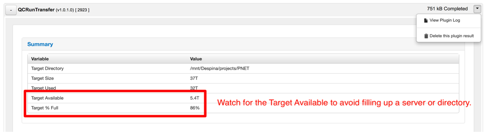

	1. There should be no errors and the MD5s should be green for all of the files. 
	If something is wrong, try looking at the log file to see if its something you can fix. 
	Otherwise contact me or your local bioinformatician ☺

		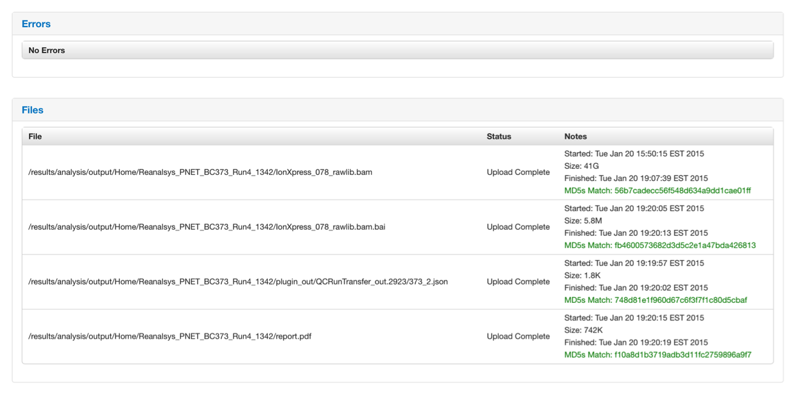

1. Retrieve the output files. The *QC\_sample.py* script
running on the analysis server will copy the output excel file and log
file to the plugin output directory. I do not yet know how to show these
files in a “pretty fashion” with a nice download button. But here is the
method to retrieve the output files:

	1. Scroll down to the “Output Files” section of the run, then click on the little “H+”

		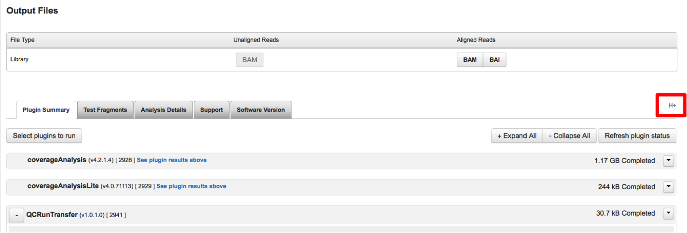

	1. You should see something like this.

		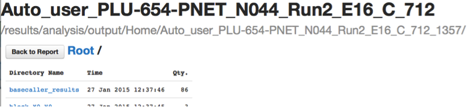

	1. Scroll down to the “plugin_out” directory.

		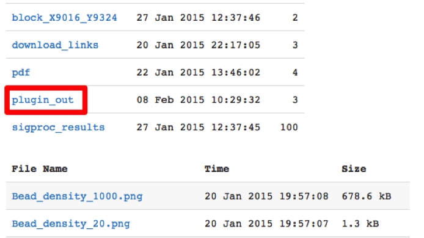

	1. Click on the QCRunTransfer_out.XXX directory. 
	The excel spreadsheet containing the QC metrics will be in that directory as “Sample_QC.xlsx” and “QC.log.” 
	These two files will be copied back to this directory (run’s plugin dir) two times throughout the script. 
	1) After each run is QC’d with each other and 2) after the runs are merged and those merged files are QC’d.

		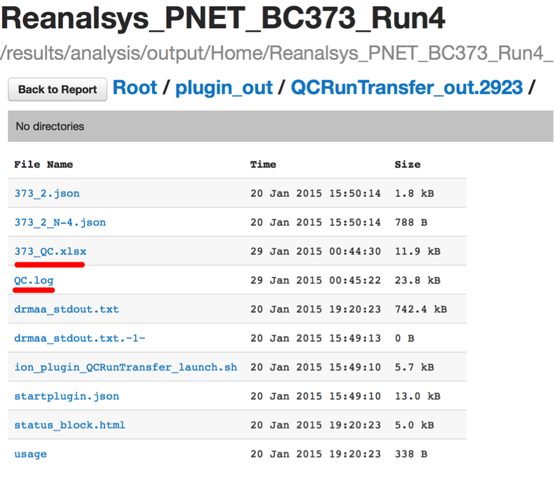
